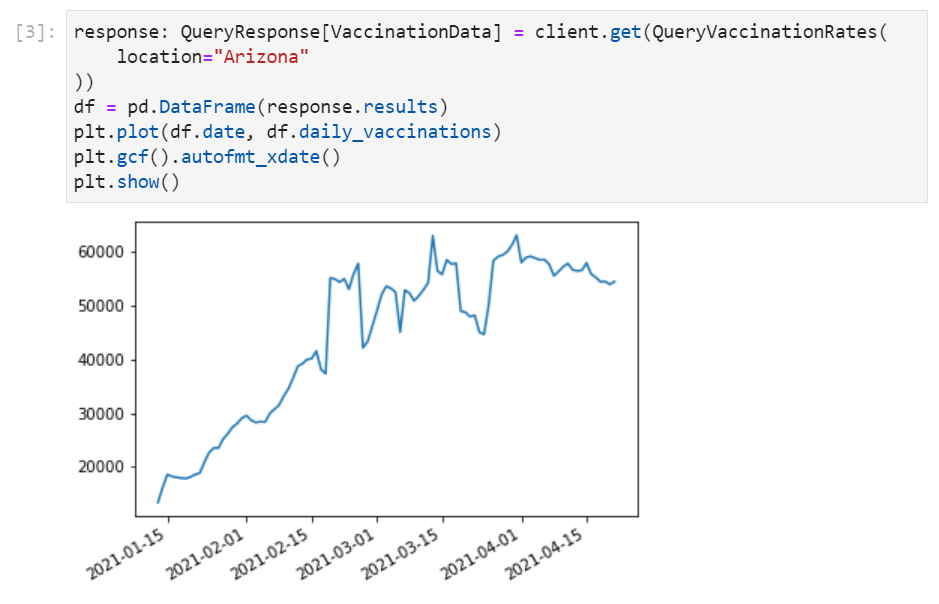

Initially forged from the [Interactive Python](https://ipython.org) project, [Jupyter](https://jupyter.org) is an exciting initiative to support an open standards, language agnostic interactive computing platform where it provides the ideal integrated exploratory programming environment for data science and scientific computing as represented by its 3 core languages for these domains in [Julia](https://julialang.org), [Python](https://python.org) and [R](https://www.r-project.org) (Ju-Py-R).

However its popularity, thriving ecosystem and rich tooling has seen it grow to encompass a wide range of interactive computing use-cases including data cleaning and transformation, numerical simulation, statistical modeling, data visualization, machine learning, and much more which now sees it support over 40 programming languages.

### Jupyter Notebooks

At the core of Jupyter is the "Notebook" (Nb) - an open JSON document format that contains a complete record of user's sessions including code, narrative text, equations, visualizations and rich output. The culmination of which facilitates the creation and sharing of Live Executable Documents encapsulating an Interactive computing session that provides an ideal visual REPL environment for exploratory programming whose results and findings can be further annotated with Markdown documentation and exported in a number of formats to facilitate knowledge sharing including: HTML, PDF, Markdown, Latex, ReStructured Text, Asciidoc, Reveal.js.

### Create Python, C# and F# Jupyter Notebooks for any ServiceStack API

By leveraging [Add ServiceStack Reference's](/add-servicestack-reference) rich, typed ecosystem we're able to tap into the exciting interactive world of Jupyter Notebooks where any of your API consumers will easily be able to generate custom-tailored notebooks for any of your APIs using a Simple UI or command-line tools:

## Notebook Apps

The core UX for experiencing Jupyter Notebooks is through a Notebook App which thanks to Jupyter's momentum and vibrant ecosystem there are now many options to choose from, optimizing for different developers use-cases and integrated development workflows.

Delivered and maintained as part of the Jupyter project are 2 self-hosted front-end Web Application UIs for authoring and running Notebooks:

### JupyterLab

JupyterLab is Jupyter's next-gen web-based development environment designed around maintaining an entire Workspace of Notebooks in a multi-tabbed splittable UI whereby many of them can be running at the same time:

An easy way to install JupyterLab is to use the pip package manager installed with Python:

    $ pip install jupyterlab

Once installed you can launch JupyterLab's UI from a directory containing your Notebooks where they'll be accessible from its built-in File Explorer UI:

    $ jupyter-lab

### Jupyter Notebook

The original Jupyter Notebook Web Application offering a simplified single document UI:

Install with Python's pip package manager:

    $ pip install notebook

Then launch from any directory containing Notebooks to open them from the Jupyter Notebook App:

    $ jupyter notebook

### PyCharm

JetBrains likely offers the most functional and capable IDEs for authoring and viewing Notebooks whose [Notebook support](https://www.jetbrains.com/help/pycharm/jupyter-notebook-support.html) is built-in to their leading Python IDE - [PyCharm](https://www.jetbrains.com/pycharm/).

In addition to all the source code assistance and analysis you can expect from JetBrains smart IDEs to assist in writing Python, it also supports debugging as well as multiple edit and preview modes. 

PyCharm is ideal for Python programmers and maintaining Notebooks as part of a Python project where it takes care of creating a Python virtual environment for the project, installing required local dependencies and executing Notebooks within the projects venv context.

#### JetBrains DataSpell

Jupyter's popularity with Data Scientists has prompted JetBrains to develop a [stand-alone DataSpell IDE](https://www.jetbrains.com/dataspell/) optimized for working with Data with a more refined lightweight UX for working with Notebooks:

### VS Code

Visual Studio Code is another IDE popular with Python Developers that has their own [built-in UX for Jupyter Notebooks](https://code.visualstudio.com/docs/datascience/jupyter-notebooks):

It provides a nicer UX over the traditional Notebook UX with niceties like intelli-sense and variable explorer and is better at opening stand-alone Notebooks outside the context of a Python project where its able to make use of pip's global OS packages.

Whilst its Python notebook support is still the most complete, it's the optimal UX for working with **C# and F# Notebooks** with its [.NET Interactive Notebooks](https://marketplace.visualstudio.com/items?itemName=ms-dotnettools.dotnet-interactive-vscode) extension, currently in Preview that's maintained as part of the [github.com/dotnet/interactive](https://github.com/dotnet/interactive) project.

## Cloud Notebook Services

The proliferation of Notebooks as an interactive computing platform, popular in machine learning, data analysis and education has spawned a number of cloud services to facilitate the management, authoring and sharing of Notebooks where as they're run and hosted in the cloud can be easily shared with anyone without requiring a local install or development environment.

### Binder

The JupyterHub team maintain their public Jupyter notebooks service at [mybinder.org](https://mybinder.org) for anyone who wants to share their interactive GitHub repositories publicly. Behind the scenes Notebooks are executed on a collection of [BinderHub Federated services](https://mybinder.readthedocs.io/en/latest/about/federation.html) using resources donated by  [Google Cloud](https://cloud.google.com), [OVH](https://www.ovh.com), [GESIS Notebooks](https://notebooks.gesis.org) and the [Turing Institute](https://turing.ac.uk).

To run your Notebooks on Binder head over to https://mybinder.org and paste the URL of your public GitHub repo containing your Jupyter Notebooks to retrieve the generated URL for your repo.

E.g. our [ServiceStack/jupyter-notebooks](https://github.com/ServiceStack/jupyter-notebooks) GitHub repo is available from:

#### [https://mybinder.org/v2/gh/ServiceStack/jupyter-notebooks/HEAD](https://mybinder.org/v2/gh/ServiceStack/jupyter-notebooks/HEAD)

Where behind-the-scenes Binder will build and host a Docker image of your repo and launch a dedicated `notebook` Web App instance to view an execute your repo's Notebooks:

The [ServiceStack/jupyter-notebooks](https://github.com/ServiceStack/jupyter-notebooks) repo contains a couple of API examples generated using our [Instant Client Apps](https://apps.servicestack.net) site to craft a [QueryVaccinationRates API](https://apps.servicestack.net/#covid-vac-watch.netcore.io/python/QueryVaccinationRates(Location:Arizona)) call that can be downloaded in a **Python Notebook**:

)

### Covid Vaccinations

In addition to previewing the raw data response in human-friendly markdown and HTML tables, you can also leverage Python's powerful [pandas](https://pandas.pydata.org) and [matplotlib](https://matplotlib.org) libraries to plot a quick visualization of the typed `QueryVaccinationRates` AutoQuery response:

### TechStacks

The [techstacks.io-FindTechnologies.ipynb](https://github.com/ServiceStack/jupyter-notebooks/blob/main/techstacks.io-FindTechnologies.ipynb) is an example of a Notebook generated by [apps.servicestack.net](https://apps.servicestack.net) which displays results in a HTML table and a human-friendly markdown table for API Responses containing a `Results` resultset, e.g:

)

When executed in either a Binder or self-hosted **notebook** web app it will render API responses that looks like:

### GitHub Auto Preview

Thanks to executed Notebooks retaining their executed outputs and GitHub's [built-in support of rendering Jupyter Notebooks](https://docs.github.com/en/github/managing-files-in-a-repository/working-with-non-code-files/working-with-jupyter-notebook-files-on-github), we can also view pre-rendered Notebooks directly in GitHub, e.g. you can view the pre-rendered output of the above Python Notebook directly on GitHub at: [techstacks.io-FindTechnologies.ipynb](https://github.com/ServiceStack/jupyter-notebooks/blob/main/techstacks.io-FindTechnologies.ipynb).

The beauty of Notebook's retaining their executed outputs within the same document is that it makes it possible to share rendered Notebooks on GitHub in different languages. As of this writing [apps.servicestack.net](https://apps.servicestack.net) lets you download Notebooks for any publicly accessible ServiceStack API in **C#**, **Python** and **F#**:

### C# TechStacks FindTechnologies Notebook

[/csharp/techstacks.io-FindTechnologies.ipynb](https://github.com/ServiceStack/jupyter-notebooks/blob/main/csharp/techstacks.io-FindTechnologies.ipynb)

### F# TechStacks FindTechnologies Notebook

[/fsharp/techstacks.io-FindTechnologies.ipynb](https://github.com/ServiceStack/jupyter-notebooks/blob/main/fsharp/techstacks.io-FindTechnologies.ipynb)

### Google Colab

 - Share by Google Drive
 - Export to GitHub

